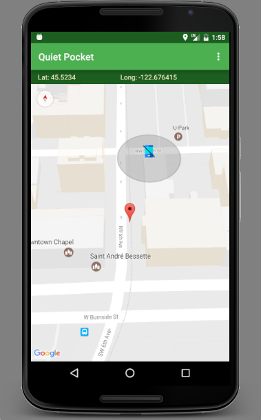

# _Quiet Pocket_

#### _12-22-2016_

#### By _**Caleb Paul**_

## Description

_Quiet Pocket is an app that adjusts the user's ringtone status based on location._
_It is designed for folks who do not want their phone to ring at an inapprapriate venue._

## User Stories
* As a user, I want my phone to switch to vibrate when I am at the movie theater, or other specified locales.
* As a user, I want my phone to switch to an audible ring when I leave the movie theater, or other specified locales.

## Setup/Installation Requirements

* _This project needs a stable version of Android Studio (preferably version 2.1+) to compile, run and emulate without issues._

* _Clone this repository (https://github.com/CalebPaul/Quiet-Pocket-Android) to your desktop._
* _Navigate to project folder using terminal._
* _Open Application in Android Studio Emulator, or, load into Android capable device._

## Known Bugs

_App development is currently in process, not all features are implemented._

## Specifications
* On opening app:
    - App requests location permissions, if needed.
    - App displays user's current location on a map.
    - User can create or clear quiet zones by clicking on ActionBar menu.

* On Create Quiet Zone:
    - App creates a GeoFence at clicked location.
    - App switches phone to vibrate when user enters GeoFence. 
    - App switches phone to audible ring when user exits GeoFence. 
        
* On Clear Quiet Zone:
    - App removes existing GeoFence.

## Support and contact details

_Caleb Paul: @calebpaulmusic_

## Technologies Used

* _Android Studio_
* _Java_

### License
*This app is licensed under the GPL license.*

Copyright (c) 2016 **_Caleb Paul_**
